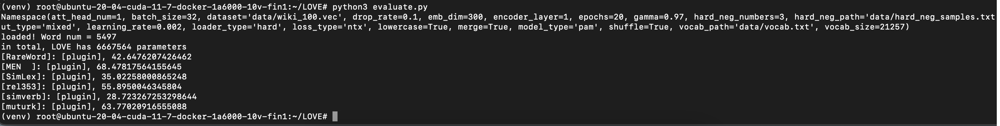
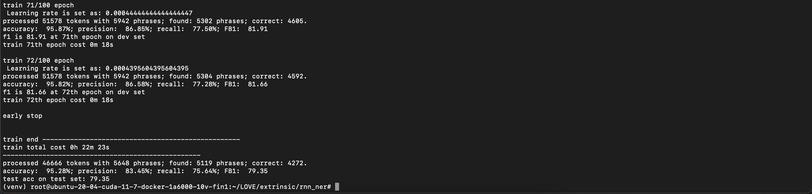
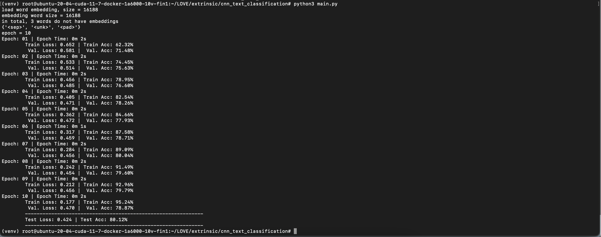

# Reproducibility challenge
This repository is the source code submission for the reproducibility challenge for the Fall 2022 course CS 421: Natural Language Processing.

### Team Member
##### Name: Amey Kasbe
##### UIC id: akasbe2

## Research Paper
Imputing Out-of-Vocabulary Embeddings with LOVE Makes LanguageModels Robust with Little Cost [[source](https://arxiv.org/abs/2203.07860)]

Source code associated with the paper [[repository](https://github.com/tigerchen52/love)]

### System Requirements
Provisioned a compute unit and GPU from a cloud service provider datacrunch.io. Machine used for reproducibility challenge:
* Compute Unit: 10-core system with 60 GBs RAM 
* GPU: RTX-A6000 GPU with 48 GBs memory

### Clone the repository
    
    git clone https://github.com/ameykasbe/LOVE.git
    
* In the original repository, the users might face a type mismatch error which has been resolved in this repository. 

### Virtual environment

* Install virtualenv module which is used to create virtual environments.
    ```
    pip install virtualenv
    ```

* Create a virtual environment 
    ```
    virtualenv venv
    ```

* Activate the virtual environment
    * Windows
       ```
       ./venv/Scripts/activate
       ```
    * macOS/Linux
       ```
       source ./venv/bin/activate
       ```

### Install dependencies
    
    pip install -r requirements.txt 


### Data Preparation
* Authors have used FastText as target vectors. 
* [Download](https://fasttext.cc/docs/en/english-vectors.html) and place the file in the `data` directory.

### Training
* Train the model using the `train.py` script.
* Use the command - 

    ```
    python train.py -dataset data/wiki-news-300d-1M.vec
    ```

### Evaluation
* Download the model file from [link](https://www.dropbox.com/s/o63h61kj3mdi4o0/love_fasttext.zip?dl=1) and place it to the `output` directory.

#### Intrinsic evaluation
* To perform intrinsic evaluation, execute the command
  ```
  python3 evaluate.py
  ```
  Results

  


#### Extrinsic evaluation
* Reproduced the two kinds of evaluation.

###### CNN Text Classification

###### RNN NER 
* Generate embeddings for all words in CoNLL03, by the following python script
  ```
  from produce_emb import gen_embeddings_for_vocab
  vocab_path = "extrinsic/rnn_ner/output/words.txt"
  emb_path = "extrinsic/rnn_ner/output/love.emb"
  gen_embeddings_for_vocab(vocab_path=vocab_path, emb_path=emb_path)
  ```
  
* Run the rnn_ner script by the following command:
    ```
    python3 extrinsic/rnn_ner/main.py
    ```
  
* Results

  

###### CNN Text Classification
* Generate embeddings for all words in SST2, by the following python script
  ```
  from produce_emb import gen_embeddings_for_vocab
  vocab_path = "extrinsic/cnn_text_classification/output/words.txt"
  emb_path = "extrinsic/cnn_text_classification/output/love.emb"
  gen_embeddings_for_vocab(vocab_path=vocab_path, emb_path=emb_path)
  ```

* Run the rnn_ner script by the following command:
    ```
    python3 extrinsic/cnn_text_classification/main.py
    ```

* Results

  


## Reference
* Lihu Chen, Gael Varoquaux, Fabian Suchanek. "Imputing Out-of-Vocabulary Embeddings with LOVE Makes LanguageModels Robust with Little Cost." (2022)

* Piotr Bojanowski, Edouard Grave, Armand Joulin, and Tomas Mikolov. 2017. "Enriching word vectors with
subword information" (2017)